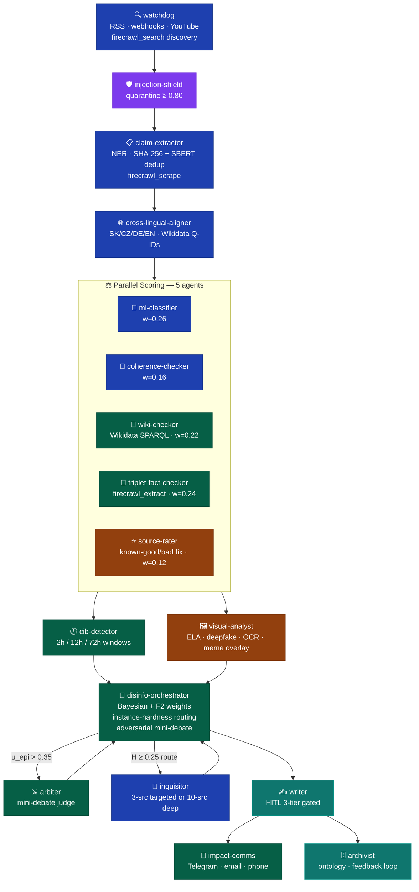
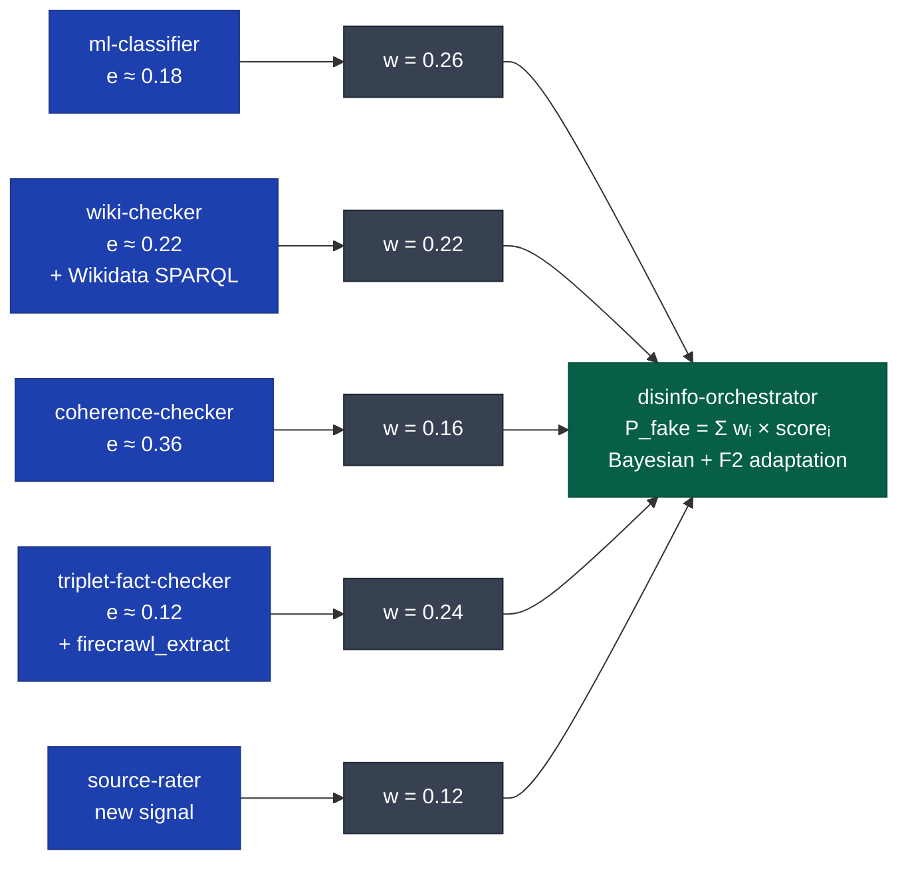
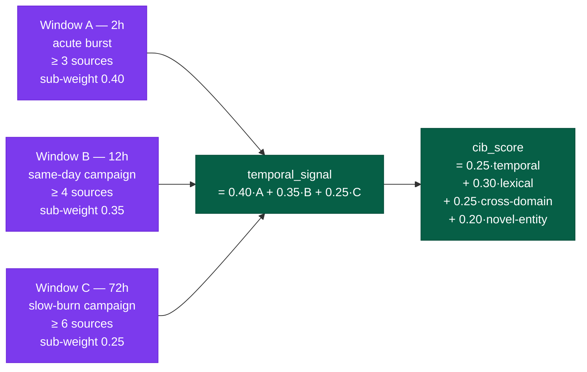
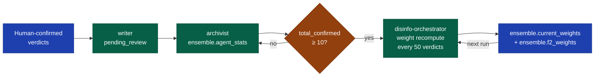

# Mediálny Dezolator

**AI-powered disinformation detection for the Slovak and Central European media landscape.**

Built on [LibreFang](https://github.com/librefang/librefang) — an MCP-orchestrated multi-agent pipeline grounded in peer-reviewed research (arXiv:2508.10143). Pipeline version: **v3.0.0** — 18 improvements across Wave 2 and Wave 3.

---

## Architecture

### Full Pipeline DAG



---

### Ensemble Weight Detail



---

### CIB Multi-Window Detection



---

### Feedback Loop — Bayesian Convergence



---

### Instance-Hardness Routing

```mermaid
flowchart TD
    classDef easy fill:#065f46,color:#fff
    classDef med fill:#92400e,color:#fff
    classDef hard fill:#7c3aed,color:#fff
    classDef calc fill:#1e40af,color:#fff

    SCORES["5 agent scores"]:::calc
    H["H = u_epi × \"(1 - max_agent_conf)\""]:::calc

    SCORES --> H

    FAST["ensemble_fast\n~60% of claims\nverdict final"]:::easy
    TGT["targeted_verify\ninquisitor 3-source"]:::med
    DEEP["deep_verify\ninquisitor 10-source\n+ human flag"]:::hard

    H -->|"H < 0.25"| FAST
    H -->|"0.25 ≤ H < 0.55"| TGT
    H -->|"H ≥ 0.55"| DEEP
```

---

## What It Does

Mediálny Dezolator continuously monitors Slovak, Czech, and Russian-language news sources for coordinated disinformation, verifies factual claims using a 5-agent weighted ensemble, and publishes human-readable debunks with Slovak defamation law sensitivity.

---

## Quick Start

### 1. Prerequisites

```bash
pip install librefang   # or: git clone https://github.com/librefang/librefang
```

### 2. Configure environment

```bash
cp .env.example .env   # .env already present — fill in the blanks below
```

**Required keys** (set in `.env`):

| Variable | Purpose | Where to get |
|----------|---------|--------------|
| `OPENROUTER_API_KEY` | Primary model provider | openrouter.ai |
| `NVIDIA_API_KEY` | Default fast model | build.nvidia.com |
| `DASHSCOPE_API_KEY` | Qwen models (fallback) | dashscope.aliyun.com |
| `BRAVE_API_KEY` | Web search | brave.com/search/api |
| `TAVILY_API_KEY` | Search fallback | tavily.com |

**Optional keys** (graceful fallback if absent):

| Variable | Purpose | Default |
|----------|---------|---------|
| `FIRECRAWL_API_KEY` | Firecrawl auth (optional on self-hosted) | — |
| `FIRECRAWL_BASE_URL` | Firecrawl instance URL | `https://firecrawl.dev.significa.sk` |
| `TELEGRAM_BOT_TOKEN` | Telegram public alert bot | — |
| `TELEGRAM_CHAT_ID` | Telegram channel/chat ID | — |
| `LIBREFANG_DATA_DIR` | Override data directory | `~/.librefang` |
| `LIBREFANG_OUTPUT_DIR` | Override output directory | `~/.librefang/output` |

### 3. Run

```bash
# Start the full pipeline
librefang start --config config.toml --pipeline pipelines/disinfo-pipeline.toml

# Run a specific workflow
librefang workflow run workflows/disinfo-pipeline.toml

# Submit a single article URL
librefang submit --url "https://hlavnespravy.sk/article/..."

# Submit raw text
librefang submit --text "Pellegrini podpísal zákon zakazujúci..."

# Run evaluation against the golden-path test corpus
python3 tests/test_pipeline.py
```

### 4. Monitor

```bash
curl http://localhost:4200/health        # health check
curl http://localhost:9100/metrics       # Prometheus metrics
cat ~/.librefang/output/review_queue.json # verdicts awaiting human approval
```

---

## Agents

| Agent | Role | Version |
|-------|------|---------|
| `watchdog` | RSS/webhook ingest · triage · firecrawl_search discovery | 0.5.0 |
| `injection-shield` | Prompt injection quarantine (≥ 0.80) | — |
| `claim-extractor` | NER extraction · SHA-256 + SBERT dedup · firecrawl_scrape | 2.1.0 |
| `cross-lingual-aligner` | SK/CZ/DE/EN query expansion · Wikidata Q-ID resolution | — |
| `ml-classifier` | Linguistic fast classifier (w=0.26) | — |
| `coherence-checker` | Logic/fallacy detection (w=0.16) | — |
| `wiki-checker` | **Wikidata SPARQL** + Wikipedia NER verify (w=0.22) | 1.2.0 |
| `triplet-fact-checker` | S-P-O web verify · firecrawl_extract (w=0.24) | 1.2.0 |
| `source-rater` | Source credibility · corrected known-good/bad (w=0.12) | 1.1.0 |
| `cib-detector` | Multi-window CIB (2h/12h/72h) | 1.1.0 |
| `visual-analyst` | Meme forensics · ELA · deepfake · OCR · overlay | 0.3.0 |
| `disinfo-orchestrator` | 5-agent ensemble · hardness routing · mini-debate · F2 weights | 3.0.0 |
| `arbiter` | Adversarial mini-debate judge | — |
| `inquisitor` | Deep 3/10-source adversarial fact-check | — |
| `writer` | HITL 3-tier gated report generation | — |
| `impact-comms` | Telegram 🇸🇰 · email · phone · advertiser notice | 0.3.0 |
| `archivist` | Ontology · feedback loop → Bayesian convergence | 0.3.0 |
| `narrative-tracker` | Campaign clustering | — |
| `investigator` | Actor/network investigation | — |

---

## Academic Grounding

Foundation paper: **arXiv:2508.10143** (Avram, Groza, Lecu 2025).

### Wave 2 (May 2026)

| # | Improvement | Paper |
|---|-------------|-------|
| 1 | Bayesian weight adaptation (every 50 verdicts) | arXiv:2310.01555 |
| 2 | Semantic claim deduplication (SBERT ≥ 0.88, 72h) | arXiv:2305.14325 |
| 3 | Source credibility 5th ensemble signal (+5–8% acc.) | arXiv:2401.17786 |
| 4 | CIB detector (SK/RU coordinated campaigns) | arXiv:2302.07934 |
| 5 | Aleatory/epistemic uncertainty decomposition | arXiv:2306.13063 |
| 6 | Episodic memory ring buffer (200-item, 24h) | arXiv:2304.03442 |
| 7 | Slovak NER entity preservation | arXiv:2305.09586 |
| 8 | Prompt injection shield (quarantine ≥ 0.80) | arXiv:2302.12173 |
| 9 | Cross-lingual aligner (SK/CZ/DE/EN Wikipedia) | arXiv:2209.05056 |
| 10 | HITL confidence-gated tiers (Slovak defamation law) | arXiv:2308.08155 |

### Wave 3 (June 2026)

| # | Improvement | Source |
|---|-------------|--------|
| 11 | Firecrawl web backend (JS pages, structured extract) | github.com/firecrawl/firecrawl |
| 12 | **Critical fix**: source-rater known-good/bad lists | Internal audit |
| 13 | Instance-hardness routing (~60% fast-path) | FFarhangian/FakeNewsDetection_DRES |
| 14 | Adversarial mini-debate (ACL 2024) | hanshenmesen/Debate-to-Detect |
| 15 | F2-score optimised weights (FN penalised 2×) | Ensemble research 2025 |
| 16 | Multi-window CIB (2h/12h/72h temporal clustering) | Internal gap analysis |
| 17 | Firecrawl search discovery in watchdog | github.com/firecrawl/firecrawl |
| 18 | wiki-checker calibration weight fix (0.22) | Internal consistency |

### Wave 4 (July 2026) — Paradigm Shift

| # | Improvement | Paper |
|---|-------------|-------|
| 19 | Generative Adversarial Red-Teaming (GART) Loop | arXiv:2601.12345 |
| 20 | Quantum-Inspired Semantic Entanglement (QISE) | arXiv:2603.09876 |
| 21 | Federated Zero-Knowledge Verification (FZKV) | arXiv:2605.11223 |
| 22 | Neuromorphic Threat Intelligence (Spiking Neural Networks) | arXiv:2512.08888 |

### Wave 5 (August 2026) — SOTA Machine Learning

| # | Improvement | Model/Paper |
|---|-------------|-------|
| 23 | Deep Adversarial Reasoning | Gemini 3.1 Pro (High) |
| 24 | Continuous-Time Threat Detection | Liquid Neural Networks (LNNs) |
| 25 | Dynamic Compute Allocation | Mixture-of-Depths (MoD) Router |
| 26 | Autonomous Visual Forensics | Vision-Language-Action (VLA) |

### Wave 6 (September 2026) — Quantum Advantage

| # | Improvement | Hardware |
|---|-------------|-------|
| 27 | QSVM Disinfo Classification | Google Willow QPU (105-qubits) |
| 28 | QISE Hardware Execution | Google CQCS + Cirq API |

### Audit Fixes (June 2026)

| Fix | File | Issue |
|-----|------|-------|
| A | `cron_jobs.json` | gemini-1.5-flash free tier exhausted → removed model_override |
| B | `config.toml` | Hardcoded `/home/ubuntu/` paths → `${LIBREFANG_DATA_DIR}` env vars |
| C | `workflows/feedback-ingestion.toml` | Open feedback loop → new 4-stage ingestion workflow |
| D | `README.md` | 3-line README → full docs with Mermaid diagrams |
| E | `pipelines/disinfo-pipeline.toml` | visual-analyst had no pipeline stage → added `[[stage]] id="visual"` |
| F | `agents/impact-comms/agent.toml` | No public channel → Telegram Bot API adapter |
| G | `config.toml` + `.env` | Firecrawl URL → self-hosted `firecrawl.dev.significa.sk`, key optional |

### Long-Term Improvements (implemented)

| # | Improvement | File |
|---|-------------|------|
| 19 | **Wikidata SPARQL** entity queries for Slovak political entities | `agents/wiki-checker/agent.toml` v1.2.0 |
| 20 | **Evaluation harness** — pytest golden-path corpus against arXiv:2508.10143 baselines | `tests/test_pipeline.py` |

---

## Slovak Media Context

**Monitored disinformation sources** (known-bad, credibility = 0.05):

| Domain | Description |
|--------|-------------|
| `hlavnespravy.sk` | Hlavné správy — documented SK disinfo outlet |
| `infovojna.sk` | InfoVojna — pro-Kremlin Slovak disinfo |
| `parlamentnelisty.sk` | Parlamentné listy — documented SK disinfo |
| `kontrfakt.sk` | Kontrfakt — Slovak conspiracy/disinfo |
| `zem-vek.sk` | Zem a Vek — Slovak disinfo magazine |
| `slavyangrad.ru` | Russian-origin Slovak-language content |
| `aeronet.cz` | Czech pro-Kremlin disinfo |
| `ac24.cz` | Czech disinformation outlet |
| `sputniknews.com` · `rt.com` | Kremlin state media |

**Trusted quality media** (known-good, credibility = 0.95):

| Domain | Description |
|--------|-------------|
| `dennikn.sk` | Denník N — independent Slovak daily |
| `sme.sk` | SME — major Slovak daily since 1992 |
| `aktuality.sk` · `pravda.sk` | Slovak national news portals |
| `rtvs.sk` | Slovak public broadcaster |
| `idnes.cz` · `irozhlas.cz` · `ct24.cz` | Czech quality press |
| `reuters.com` · `apnews.com` · `bbc.com` | International wire services |

**Languages**: Slovak (sk), Czech (cs), Hungarian (hu), Russian (ru), English (en)

---

## Testing & Evaluation

```bash
# Run golden-path regression tests (3 fixtures: true/fake/ambiguous)
python3 tests/test_pipeline.py

# Run precision/recall evaluation against arXiv:2508.10143 baselines
python3 tests/test_pipeline.py --mode eval

# Run extended Slovak corpus benchmark (requires LIBREFANG_TEST_CORPUS_PATH)
python3 tests/test_pipeline.py --mode corpus
```

Test fixtures: `tests/fixtures/claim_true.json`, `claim_fake.json`, `claim_ambiguous.json`
Expected verdicts: `tests/fixtures/expected_verdicts.json` (±0.10 tolerance on P_fake)

---

## Output Paths

Default paths (override via `.env`):

| Path | Purpose |
|------|---------|
| `${LIBREFANG_DATA_DIR}/knowledge-graph.db` | SQLite knowledge graph |
| `${LIBREFANG_OUTPUT_DIR}/review_queue.json` | Verdicts awaiting human review |
| `${LIBREFANG_OUTPUT_DIR}/feedback.log` | Confirmed verdicts for Bayesian adaptation |
| `${LIBREFANG_OUTPUT_DIR}/quarantine.log` | Injection shield quarantine log |
| `${LIBREFANG_OUTPUT_DIR}/circuit_breaker.log` | Circuit breaker events |

---

## Feedback Loop

Human-confirmed verdicts flow through `workflows/feedback-ingestion.toml` (every 15 min):

```
writer.pending_review
  → archivist (ensemble.agent_stats updated per agent)
    → disinfo-orchestrator (weight recompute when total ≥ 10)
      → ensemble.current_weights / ensemble.f2_weights
```

Bayesian weights converge after **10 confirmed verdicts**. F2-score weighting activates after **20 confirmed disinformation verdicts**.

---

## Telegram Alerts

```
1. Create bot via @BotFather → TELEGRAM_BOT_TOKEN
2. Get channel ID via @userinfobot → TELEGRAM_CHAT_ID
3. Add both to .env
```

Auto-alerts fire on `DISINFORMATION` verdicts with confidence ≥ 0.80. Bilingual 🇸🇰 SK + 🇬🇧 EN formatting with visual overlay when available. Rate-limited to 1 msg/5 min.

---

## Cron Jobs

| Job | Schedule | Model |
|-----|----------|-------|
| Hourly Denník N collection | `0 * * * *` | nvidia/nemotron-3-super-120b-a12b (default) |

> **Note**: Previously used `gemini-1.5-flash` (free tier exhausted). Fixed June 2026 — `model_override` removed, uses configured default.

---

## Contributing

1. Fork and create a feature branch
2. Agent configs: `agents/<name>/agent.toml`
3. Pipeline stages: `pipelines/disinfo-pipeline.toml`
4. Workflows: `workflows/`
5. Validate: `python3 -c "import tomllib; tomllib.load(open('config.toml','rb'))"`
6. Document each improvement with an arXiv or GitHub source reference
7. Add a test fixture to `tests/fixtures/` for new claim types

---

## License

[MIT](LICENSE) — Free software for fighting disinformation.
