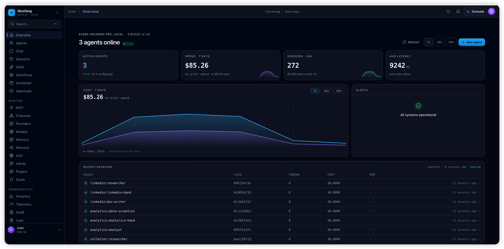
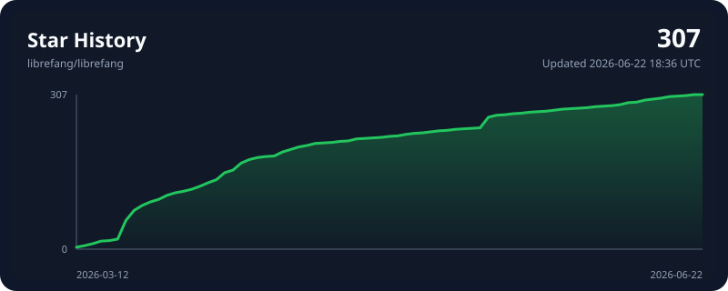

<p align="center">
  
</p>

<h1 align="center">LibreFang</h1>
<h3 align="center">Libre Agent Operating System — Free as in Freedom</h3>

<p align="center">
  Open-source Agent OS built in Rust. 30 crates. 2,100+ tests. Zero clippy warnings.
</p>

<p align="center">
  <a href="README.md">English</a> | <a href="i18n/README.zh.md">中文</a> | <a href="i18n/README.ja.md">日本語</a> | <a href="i18n/README.ko.md">한국어</a> | <a href="i18n/README.es.md">Español</a> | <a href="i18n/README.de.md">Deutsch</a> | <a href="i18n/README.pl.md">Polski</a> | <a href="i18n/README.fr.md">Français</a> | <a href="i18n/README.uk.md">Українська</a>
</p>

<p align="center">
  <a href="https://librefang.ai/">Website</a> &bull;
  <a href="https://docs.librefang.ai">Docs</a> &bull;
  <a href="CONTRIBUTING.md">Contributing</a> &bull;
  <a href="https://discord.gg/DzTYqAZZmc">Discord</a>
</p>

<p align="center">
  <a href="https://github.com/librefang/librefang/actions/workflows/ci.yml"></a>
  
  
  
  
  <a href="https://discord.gg/DzTYqAZZmc"></a>
  <a href="https://deepwiki.com/librefang/librefang"></a>
</p>

---

## What is LibreFang?

LibreFang is an **Agent Operating System** — a full platform for running autonomous AI agents, built from scratch in Rust. Not a chatbot framework, not a Python wrapper.

Traditional agent frameworks wait for you to type something. LibreFang runs **agents that work for you** — on schedules, 24/7, monitoring targets, generating leads, managing social media, and reporting to your dashboard.

> LibreFang is a community fork of [`RightNow-AI/openfang`](https://github.com/RightNow-AI/openfang) with open governance and a merge-first PR policy. See [GOVERNANCE.md](GOVERNANCE.md) for details.

<p align="center">
  
</p>

## Quick Start

```bash
# Install (Linux/macOS/WSL)
curl -fsSL https://librefang.ai/install.sh | sh

# Or install via Cargo
cargo install --git https://github.com/librefang/librefang librefang-cli

# Start — auto-initializes on first run, dashboard at http://localhost:4545
librefang start

# Or run the setup wizard manually for interactive provider selection
# librefang init
```

<details>
<summary><strong>Homebrew</strong></summary>

```bash
brew tap librefang/tap
brew install librefang              # CLI (stable)
brew install --cask librefang       # Desktop (stable)
# Beta/RC channels also available:
# brew install librefang-beta       # or librefang-rc
# brew install --cask librefang-rc  # or librefang-beta
```

</details>

<details>
<summary><strong>Docker</strong></summary>

```bash
docker run -p 4545:4545 ghcr.io/librefang/librefang
```

</details>

<details>
<summary><strong>Cloud Deploy</strong></summary>

[](https://deploy.librefang.ai) [](https://deploy.librefang.ai) [](https://render.com/deploy?repo=https://github.com/librefang/librefang) [](https://railway.app/template/librefang) [](deploy/gcp/README.md)

</details>

## Hands: Agents That Work for You

**Hands** are autonomous capability packages that run independently, on schedules, without prompting. Each Hand is defined by a `HAND.toml` manifest, a system prompt, and optional `SKILL.md` files loaded from your configured `hands_dir`.

Example Hand definitions (Researcher, Collector, Predictor, Strategist, Analytics, Trader, Lead, Twitter, Reddit, LinkedIn, Clip, Browser, API Tester, DevOps) are available in the [community hands repository](https://github.com/librefang-registry/hands).

```bash
# Install a community Hand, then:
librefang hand activate researcher   # Starts working immediately
librefang hand status researcher     # Check progress
librefang hand list                  # See all installed Hands
```

Build your own: define a `HAND.toml` + system prompt + `SKILL.md`. [Guide](https://docs.librefang.ai/agent/skills)

## Architecture

30 Rust crates + xtask, modular kernel design.

```
librefang-kernel            Orchestration, workflows, metering, RBAC, scheduler, budget
librefang-runtime           Agent loop, tool execution, WASM sandbox, MCP, A2A
librefang-api               140+ REST/WS/SSE endpoints, OpenAI-compatible API, dashboard
librefang-channels          45 messaging adapters with rate limiting, DM/group policies
librefang-memory            SQLite persistence, vector embeddings, sessions, compaction
librefang-types             Core types, taint tracking, Ed25519 signing, model catalog
librefang-skills            60 bundled skills, SKILL.md parser, FangHub marketplace
librefang-hands             HAND.toml parser, Hand registry, lifecycle management
librefang-extensions        25 MCP templates, AES-256-GCM vault, OAuth2 PKCE
librefang-wire              OFP P2P protocol, HMAC-SHA256 mutual auth (see note)
librefang-cli               CLI, daemon management, TUI dashboard, MCP server mode
librefang-desktop           Tauri 2.0 native app (tray, notifications, shortcuts)
librefang-import            OpenClaw, LangChain, AutoGPT import/migration engine
librefang-http              Shared HTTP client builder, proxy, TLS fallback
librefang-testing           Test infrastructure: mock kernel, mock LLM driver and API route test utilities
librefang-telemetry         OpenTelemetry + Prometheus metrics instrumentation for LibreFang
librefang-llm-driver        LLM driver trait and shared types for LibreFang
librefang-llm-drivers       Concrete LLM provider drivers (anthropic, openai, gemini, …) implementing librefang-llm-driver trait
librefang-runtime-mcp       MCP (Model Context Protocol) client for LibreFang runtime
librefang-kernel-handle     KernelHandle trait for in-process callers into the LibreFang kernel
librefang-kernel-router     Hand/Template routing engine for the LibreFang kernel
librefang-kernel-metering   Cost metering, quota enforcement for the LibreFang kernel
librefang-subprocess        Subprocess execution utilities and IPC
librefang-runtime-audit     Audit logging and taint tracking for the runtime
librefang-runtime-media     Media processing and conversion for the runtime
librefang-runtime-sandbox-docker Docker-based sandboxing for the runtime
librefang-rl-export         RLHF/DPO preference pair export and endpoints
librefang-memory-wiki       Compaction strategies and wiki knowledge vault
librefang-acp               Agent Client Protocol server adapter
xtask                       Build automation
```

> **OFP wire is plaintext-by-design.** HMAC-SHA256 mutual auth + per-message
> HMAC + nonce replay protection cover *active* attackers, but frame contents
> are not encrypted. For cross-network federation, run OFP behind a private
> overlay (WireGuard, Tailscale, SSH tunnel) or a service-mesh mTLS layer.
> Details: [docs.librefang.ai/architecture/ofp-wire](https://docs.librefang.ai/architecture/ofp-wire)

## Key Features

**45 Channel Adapters** — Telegram, Discord, Slack, WhatsApp, Signal, Matrix, Email, Teams, Google Chat, Feishu, LINE, Mastodon, Bluesky, and 32 more. [Full list](https://docs.librefang.ai/integrations/channels)

**28 LLM Providers** — Anthropic, Gemini, OpenAI, Groq, DeepSeek, OpenRouter, Ollama, Alibaba Coding Plan, and 20 more. Intelligent routing, automatic fallback, cost tracking. [Details](https://docs.librefang.ai/configuration/providers)

**16 Security Layers** — WASM sandbox, Merkle audit trail, taint tracking, Ed25519 signing, SSRF protection, secret zeroization, and more. [Details](https://docs.librefang.ai/getting-started/comparison#16-security-systems--defense-in-depth)

**OpenAI-Compatible API** — Drop-in `/v1/chat/completions` endpoint. 140+ REST/WS/SSE endpoints. [API Reference](https://docs.librefang.ai/integrations/api)

**Client SDKs** — Full REST client with streaming support.

```javascript
// JavaScript/TypeScript
npm install @librefang/sdk
const { LibreFang } = require("@librefang/sdk");
const client = new LibreFang("http://localhost:4545");
const agent = await client.agents.create({ template: "assistant" });
const reply = await client.agents.message(agent.id, "Hello!");
```

```python
# Python
pip install librefang
from librefang import Client
client = Client("http://localhost:4545")
agent = client.agents.create(template="assistant")
reply = client.agents.message(agent["id"], "Hello!")
```

```rust
// Rust
cargo add librefang
use librefang::LibreFang;
let client = LibreFang::new("http://localhost:4545");
let agent = client.agents().create(CreateAgentRequest { template: Some("assistant".into()), .. }).await?;
```

```go
// Go
go get github.com/librefang/librefang/sdk/go
import "github.com/librefang/librefang/sdk/go"
client := librefang.New("http://localhost:4545")
agent, _ := client.Agents.Create(map[string]interface{}{"template": "assistant"})
```

**MCP Support** — Built-in MCP client and server. Connect to IDEs, extend with custom tools, compose agent pipelines. [Details](https://docs.librefang.ai/integrations/mcp-a2a)

**A2A Protocol** — Google Agent-to-Agent protocol support. Discover, communicate, and delegate tasks across agent systems. [Details](https://docs.librefang.ai/integrations/mcp-a2a)

**Desktop App** — Tauri 2.0 native app with system tray, notifications, and global shortcuts.

**OpenClaw Migration** — `librefang migrate --from openclaw` imports agents, history, skills, and config.

## Development

```bash
cargo build --workspace --lib                            # Build
cargo test --workspace                                   # 2,100+ tests
cargo clippy --workspace --all-targets -- -D warnings    # Zero warnings
cargo fmt --all -- --check                               # Format check
```

### Committing changes

Use `scripts/commit.sh` instead of `git commit` directly so staged Rust
files are rustfmt-clean before the pre-commit hook gates them:

```bash
scripts/commit.sh -m "feat: add foo"
scripts/commit.sh -F .git/COMMIT_EDITMSG
```

The wrapper runs `cargo fmt` on staged `*.rs` files, re-stages them, and
holds a soft lock against parallel commits in the same worktree. All flags
are forwarded to `git commit` unchanged. If `cargo` is unavailable the
script skips formatting and warns; the pre-commit hook still gates the
commit.

## Comparison

See [Comparison](https://docs.librefang.ai/getting-started/comparison#16-security-systems--defense-in-depth) for benchmarks and feature-by-feature comparison vs OpenClaw, ZeroClaw, CrewAI, AutoGen, and LangGraph.

## Links

- [Documentation](https://docs.librefang.ai) &bull; [API Reference](https://docs.librefang.ai/integrations/api) &bull; [Getting Started](https://docs.librefang.ai/getting-started) &bull; [Troubleshooting](https://docs.librefang.ai/operations/troubleshooting)
- [Contributing](CONTRIBUTING.md) &bull; [Governance](GOVERNANCE.md) &bull; [Security](SECURITY.md)
- Discussions: [Q&A](https://github.com/librefang/librefang/discussions/categories/q-a) &bull; [Use Cases](https://github.com/librefang/librefang/discussions/categories/show-and-tell) &bull; [Feature Votes](https://github.com/librefang/librefang/discussions/categories/ideas) &bull; [Announcements](https://github.com/librefang/librefang/discussions/categories/announcements) &bull; [Discord](https://discord.gg/DzTYqAZZmc)

## Contributors

<a href="https://github.com/librefang/librefang/graphs/contributors">
  
</a>

<p align="center">
  We welcome contributions of all kinds — code, docs, translations, bug reports.<br/>
  Check the <a href="CONTRIBUTING.md">Contributing Guide</a> and pick a <a href="https://github.com/librefang/librefang/issues?q=is%3Aissue+is%3Aopen+label%3A%22good+first+issue%22">good first issue</a> to get started!<br/>
  You can also visit the <a href="https://leszek3737.github.io/librefang-WIki/">unofficial wiki</a>, which is updated with helpful information for new contributors.
</p>

<p align="center">
  <a href="https://github.com/librefang/librefang/stargazers">
    
  </a>
</p>

---

<p align="center">MIT License</p>

---

---

## Mediálny Dezolator — Disinformation Detection Pipeline

Pipeline version: **v3.1.0** — Wave 3.5 Methodological Integrity Improvements

An open-source, MCP-orchestrated multi-agent disinformation detection pipeline for the Slovak and Central European media landscape.

### Implemented Features (Waves 2–3.5)

| Wave | Feature | Status |
|---|---|---|
| 2 | Bayesian ensemble weight adaptation | ✅ Implemented |
| 2 | Semantic claim deduplication (SBERT) | ✅ Implemented |
| 2 | Multi-source credibility registry (NewsGuard, MBFC, EUvsDisinfo, Konšpirátori.sk) | ✅ Implemented |
| 2 | CIB Detector (coordinated inauthentic behaviour) | ✅ Implemented |
| 2 | Aleatory/epistemic uncertainty decomposition + 4-case routing | ✅ Implemented |
| 2 | Slovak NER entity preservation | ✅ Implemented |
| 2 | Prompt injection shield | ✅ Implemented |
| 2 | Cross-lingual aligner (SlavicBERT + XLM-R) | ✅ Implemented |
| 2 | HITL confidence-gated tiers | ✅ Implemented |
| 3 | Firecrawl web backend | ✅ Implemented |
| 3 | Instance-hardness dynamic routing (DRES) | ✅ Implemented |
| 3 | Adversarial mini-debate (arbiter) | ✅ Implemented |
| 3 | F2-score optimised weight recomputation | ✅ Implemented |
| 3 | Multi-window CIB detection (2h/12h/72h) | ✅ Implemented |
| 3.5 | **FIX-1**: Source-rater weight corrected (0.12→0.08), wiki +0.04 | ✅ Implemented |
| 3.5 | **FIX-2**: SlovakBERT primary → SlavicBERT → XLM-R → TF-IDF fallback | ✅ Implemented |
| 3.5 | **FIX-3**: Explicit u_ale/u_epi decomposition with 4-case routing | ✅ Implemented |
| 3.5 | **FIX-4**: Information laundering provenance chain tracking (72h/SBERT 0.82) | ✅ Implemented |
| 3.5 | **IMPROVE-1**: 200-article calibration corpus + FPR ≤ 5% threshold | ✅ Implemented |
| 3.5 | **IMPROVE-2**: Krippendorff α inter-annotator agreement enforcement | ✅ Implemented |
| 3.5 | **IMPROVE-3**: SBERT semantic CIB matching + network amplification signal | ✅ Implemented |
| 3.5 | **IMPROVE-4**: GART adversarial red-teaming loop (weekly, bypass threshold 30%) | ✅ Implemented |
| 3.5 | **TRANSPARENCY-1**: Weight history audit trail + automatic weight revert | ✅ Implemented |
| 3.5 | **TRANSPARENCY-2**: Full citation audit (CITATION_AUDIT.md) | ✅ Implemented |
| 3.5 | **TRANSPARENCY-3**: Annotation guidelines + ethics framework | ✅ Implemented |

### Wave 3.5 — Methodological Integrity Improvements

**Version 3.1.0** addresses the following structural correctness issues:

#### FIX-1: Source-rater circular prior eliminated
The known-bad/known-good lists were replaced with a multi-source credibility registry synthesizing ratings from four **independently maintained** external sources (NewsGuard, MBFC, EUvsDisinfo, Konšpirátori.sk). A weighted fusion function assigns `credibility_score = weighted_mean(scores)`. If fewer than 2 sources agree, the item is flagged for human review. The source-rater weight was reduced from 0.12 → 0.08 in the ensemble, with +0.04 compensating wiki-checker (Wikidata SPARQL is reproducible and auditable).
> Reference: Baly et al., "Multi-Source Fake News Classification" (arXiv:1908.05049)

#### FIX-2: Transformer classifier replaces TF-IDF+LR
The ml-classifier (highest-weighted signal) previously used TF-IDF + Logistic Regression, a bag-of-words model that loses Slovak morphological variants and syntactic negation. Replaced with SlovakBERT (F1=0.8931) as primary, SlavicBERT (F1=0.8661) as secondary, and XLM-RoBERTa (F1=0.8311) as third fallback. TF-IDF+LR retained only as CPU-only baseline, clearly labeled "NOT recommended for production."
> References: Arkhipov et al. SlavicBERT (arXiv:1912.07076); Conneau et al. XLM-R (arXiv:1911.02116)

#### FIX-3: Decomposed aleatory/epistemic uncertainty with 4-case routing
The prior combined uncertainty `H = u_epi × (1 - max_agent_conf)` conflated two distinct types requiring different responses. The 4-case routing now: **Case A** (high u_ale, low u_epi) → HITL "AMBIGUOUS"; **Case B** (low u_ale, high u_epi) → inquisitor escalation; **Case C** (both high) → arbiter mini-debate then HITL; **Case D** (both low) → fast path.
> References: Kendall & Gal (arXiv:1703.04977); Kadavath et al. (arXiv:2306.13063)

#### FIX-4: Information laundering blind spot patched
Source credibility = 0.95 for trusted outlets created a blind spot for laundering (low-credibility narrative → high-credibility outlet republication). Claim-extractor now tracks provenance chains with SBERT cosine ≥ 0.82, 72h lookback via archivist KG. `laundering_risk_score > 0.60` overrides source credibility to neutral (0.50) and flags "LAUNDERING RISK".
> Reference: Alliance for Europe, "Information Laundering in Slovakia", March 2026

#### IMPROVE-2: Inter-annotator agreement enforced
Borderline claims (P_fake ∈ [0.45, 0.75]) require minimum 2 independent annotators. Krippendorff's α is computed every 50 verdicts. If α < 0.65, the Bayesian weight update loop is automatically paused and a Telegram alert is sent.
> Reference: Krippendorff (2011), "Agreement on Agreement in Content Analysis"

#### IMPROVE-3: SBERT semantic CIB matching
Replaced lexical similarity with SBERT semantic similarity (cosine ≥ 0.75) for cross-source claim matching. New formula: `cib_score = 0.20·temporal + 0.30·semantic + 0.25·cross-domain + 0.15·novel-entity + 0.10·network-amplification`. Network amplification signal added: 3+ known-bad sources publishing semantically similar claims within a temporal window escalates cib_score +0.15.
> Reference: Nied et al., "Coordinated Inauthentic Behavior" (arXiv:2302.07934)

#### IMPROVE-4: GART adversarial red-teaming (implemented)
The `gart-synthesizer` agent has been promoted from `agents/speculative/` to `agents/` with a complete system prompt implementing 5 evasion strategies. Weekly Sunday evaluation. Bypass threshold set at 30%. GART outputs are **strictly segregated** from real training data.
> Reference: Perez et al., "Red Teaming Language Models" (arXiv:2202.03286)

### Known Limitations

> [!CAUTION]
> Operators deploying this system MUST acknowledge these limitations before publishing any verdicts.

1. **Source-rater provenance dependency** (even after FIX-1): Credibility scores depend on external registry coverage. Lesser-known Slovak portals may be absent from NewsGuard/MBFC, resulting in `credibility_confidence < 2` and neutral fallback scores rather than meaningful ratings.

2. **Transformer classifier training data quality**: SlovakBERT is trained on FakeNewsDetection_DRES. Claims from domains, time periods, or narrative types outside that distribution may be misclassified. The model has not been validated on post-2025 Slovak disinformation campaigns.

3. **CIB detection window thresholds empirically unvalidated**: The 2h/12h/72h temporal windows and SBERT 0.75/0.82 similarity thresholds were not calibrated against confirmed Slovak CIB campaigns. They are adapted from general social media research and may over- or under-trigger.

4. **Slovak legal constraints on automated verdict publication**: Under Slovak defamation law (§373 Trestného zákona), automated verdicts naming specific outlets or journalists cannot be published without human review and corroboration from independent wire services. This system must NEVER be used to publish verdicts without operator human oversight.

### Research Roadmap (Not Yet Implemented)

> [!NOTE]
> The following features are documented research directions. They are NOT implemented in the current pipeline. See `agents/speculative/` for architectural stubs.

| Feature | Description | Dependency |
|---|---|---|
| Temporal Graph Networks (TGN) | Continuous-time CIB detection replacing discrete windows | GPU + Rossi et al. (2020) training data |
| QSVM Classifier | Quantum SVM for narrative classification | Google Willow 105-qubit QPU (unavailable) |
| ZK Attestation | Zero-knowledge proof attestation for verdicts | ZK cryptographic infrastructure |
| Liquid Neural Networks | Continuous-time windowless CIB detection | LNN training framework |
| A2A External Claim Federation | External claims from CEDMO/Demagog.sk via Google A2A | Partner agreements |

### Wave 4 — Citation Repair & Academic Uplift

| Improvement | Replaced Citation |
|---|---|
| **1: Bayesian weight adaptation** | Opitz & Maclin (1999) JAIR + Hoeting et al. (1999) Stat.Sci. |
| **2: Semantic claim deduplication** | Reimers & Gurevych (2019) arXiv:1908.10084 |
| **3: Source credibility** | Falcone & Castelfranchi (2001) + Horne et al. (2019) |
| **4: CIB detector** | Nizzoli et al. ICWSM 2021 (arXiv:2008.08370) + Cresci et al. 2022 |
| **7: Slovak NER entity preservation** | Ardevop-sk/sk-bert-ner + Raychani + ju-bezdek/slovakbert-conll2003-sk-ner |
| **9: Cross-lingual aligner** | DeepPavlov/Slavic-BERT-NER + Conneau et al. XLM-R (arXiv:1911.02116) |
| **14: Adversarial mini-debate** | Du et al. ICML 2024 (arXiv:2305.14325) + Ding et al. 2025 (arXiv:2503.23329) |

