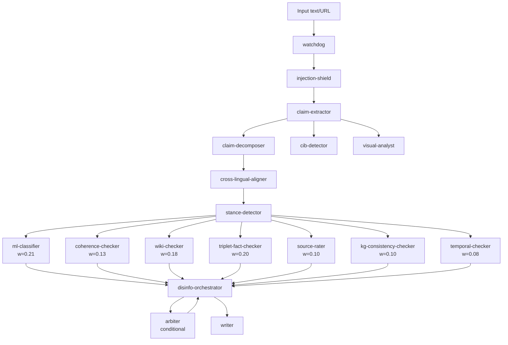

# MCP Disinformation Detection Pipeline (v4.0.0)

> Implementation of arXiv:2508.10143 — "MCP-Orchestrated Multi-Agent System for Automated Disinformation Detection"
> Avram, Groza, Lecu (2025)
>
> **Wave 4: Academic Upgrade Pack** includes QA decomposition, KG consistency checking, temporal verification, narrative framing detection, stance pre-filtering, and graph-based narrative propagation.

## Architecture



All agents share a **live MCP context** (`memory_store`/`memory_recall`) so each downstream agent benefits from prior agents' findings without explicit message passing.

## Weighted Aggregation (9-Agent Ensemble)

Weights are adaptive (Bayesian update + F2 score optimization) but start with baseline values:

| Agent | Baseline Weight | Papers |
|-------|-----------------|--------|
| `ml-classifier` | 0.21 | Baseline |
| `coherence-checker` | 0.13 | arXiv:2305.16507, arXiv:2210.12029 |
| `wiki-checker` | 0.18 | Baseline |
| `triplet-fact-checker` | 0.20 | Baseline |
| `source-rater` | 0.10 | arXiv:2401.17786 |
| `kg-consistency-checker` | 0.10 | arXiv:2209.01060 |
| `temporal-checker` | 0.08 | arXiv:2211.07830, arXiv:2309.01771 |

Final fake probability per claim (`P_fake`) is derived by aggregating scores according to these weights and applying instance-hardness routing.

## Verdict Thresholds

| P_fake | Verdict |
|--------|------------------|
| ≥ 0.70 | DISINFORMATION |
| ≥ 0.50 | SUSPICIOUS |
| ≥ 0.35 | UNCERTAIN |
| < 0.35 | CREDIBLE |

## Wave 4 Academic Upgrades

1. **Claim Decomposition**: Complex multi-hop claims are QA-decomposed (arXiv:2112.09122) by `claim-decomposer`.
2. **KG Consistency**: `kg-consistency-checker` reasons over local KG triples to detect logical contradiction (arXiv:2209.01060).
3. **Temporal Verification**: `temporal-checker` flags anachronistic attributions and temporal mismatches (arXiv:2211.07830).
4. **Stance Detection**: `stance-detector` acts as a pre-filter, bypassing fact-checks for UNRELATED claims (arXiv:2006.03644).
5. **Graph-Based CIB**: `cib-detector` calculates betweenness centrality on the claim propagation graph (arXiv:2309.13049).
6. **Narrative Framing**: `coherence-checker` analyzes texts for fear-amplification and us-vs-them framing.

## API / MCP Context Keys

| Agent | Writes key | Reads keys |
|-------|------------|------------|
| claim-extractor | `claim_extractor.output` | `injection_shield.output` |
| claim-decomposer | `claim_decomposer.output` | `claim_extractor.*` |
| cross-lingual-aligner| `cross_lingual_aligner.output`| `claim_decomposer.*` |
| stance-detector | `stance_detector.output` | `claim_extractor.*` |
| ml-classifier | `ml_classifier.output` | `claim_extractor.*` |
| coherence-checker | `coherence_checker.output` | `claim_extractor.*` |
| wiki-checker | `wiki_checker.output` | `claim_extractor.*`, `cross_lingual_aligner.*` |
| triplet-fact-checker| `triplet_fact_checker.output`| `stance_detector.*`, `cross_lingual_aligner.*` |
| kg-consistency-checker| `kg_checker.output` | `claim_extractor.*`, `cross_lingual_aligner.*` |
| temporal-checker | `temporal_checker.output` | `claim_extractor.*`, `wiki_checker.*`, `watchdog.*` |
| cib-detector | `cib_detector.output` | `claim_extractor.*` |
| disinfo-orchestrator| `orchestrator.verdicts` | all of the above |
| writer | `writer.*` | `orchestrator.*`, `cib_detector.*` |

## Running the Pipeline

The pipeline is orchestrated automatically via `librefang` and the MCP protocol as defined in `pipelines/disinfo-pipeline.toml`.

```bash
librefang run --pipeline pipelines/disinfo-pipeline.toml
```
