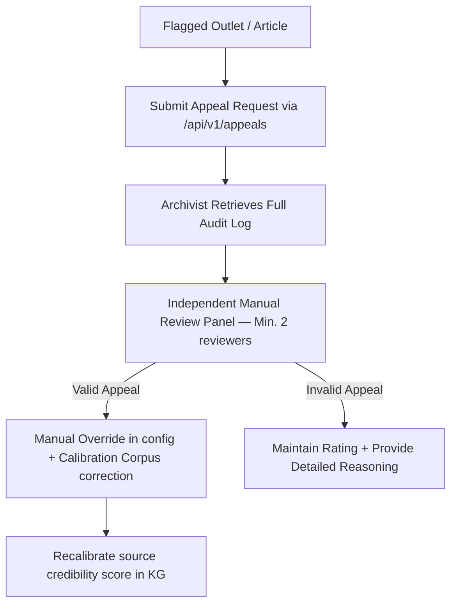

# Ethical Framework & Legal Compliance Guidelines

Mediálny Dezolator is designed to detect and flag disinformation campaigns in the Slovak and Central European media landscape. Given the high stakes of labeling content as "disinformation" or "inauthentic," this document outlines our ethical boundaries, legal compliance strategies (specifically regarding Slovak defamation law), false positive mitigation, and appeal processes.

> **Wave 3.5 — TRANSPARENCY-3**: Ethics framework expanded with:
> - Explicit scope limitations (what the system can and cannot conclude)
> - Decomposed uncertainty (u_ale/u_epi) routing references
> - Operator responsibilities for human oversight
> - Enhanced appeal mechanism
>
> Referenced in: `agents/writer/agent.toml` system prompt.

---

## 1. Scope and Limitations

### What This System CAN Conclude
* A claim contains **factual assertions** that are verifiably false, based on evidence from multiple independent sources.
* A set of sources shows **coordinated inauthentic behavior** (temporal/semantic coordination above threshold).
* A claim's narrative **originated from a known-bad source** within 72h (information laundering signal).
* A source's credibility score as synthesized from ≥2 external registries (NewsGuard, MBFC, EUvsDisinfo, Konšpirátori.sk).

### What This System CANNOT Conclude
* Whether a journalist or editor **intentionally** spread disinformation (requires intent evidence beyond automated detection).
* Whether an article is **propaganda** (a legal/political judgment requiring human expertise).
* Whether **satire, opinion, or contested political claims** are disinformation (explicitly out of scope).
* Whether a **borderline source** (u_ale > 0.30) is credible or not (human judgment required).
* Any verdict with automated confidence alone — **all high-stakes verdicts require human confirmation** before publication.

---

## 2. Ethical Boundaries

Our multi-agent system operates under strict ethical guidelines to preserve democratic discourse and avoid weaponization:

* **Respect for Free Speech**: The system must distinguish between malicious, coordinated disinformation and legitimate expression of opinion, dissent, political commentary, or satire.
* **Political Neutrality**: Agents must evaluate claims based on empirical factuality, source reliability, and coordination metrics, without political or ideological bias. The ensemble weights are publicly auditable via `output/weight_history.jsonl`.
* **Algorithmic Transparency**: All system classifications must output the provenance chain, confidence scores, and decomposed uncertainty metrics (`u_ale` and `u_epi`) to ensure that automated decisions are fully auditable by human operators.
* **Anti-Weaponization**: This system must NOT be used by political parties, governments, or commercial entities to target political opponents or competitors. Any evidence of such use must be reported to the maintainers.

---

## 3. Uncertainty-Based Ethical Routing (Wave 3.5 FIX-3)

The pipeline distinguishes between two types of uncertainty with distinct ethical implications:

| Uncertainty Type | Definition | Ethical Implication | System Response |
|---|---|---|---|
| **Aleatory (u_ale)** | Agent score variance > 0.30; irreducible claim ambiguity | Claim may be satire, opinion, or genuinely contested — human judgment required | Route to HITL: "AMBIGUOUS — human judgment required" |
| **Epistemic (u_epi)** | Evidence gap > 0.35; reducible with more evidence | System has insufficient information to make a judgment | Escalate to inquisitor for evidence gathering |
| **Both high** | Both u_ale > 0.30 AND u_epi > 0.35 | Maximum uncertainty — system cannot reliably judge | Arbiter debate, then mandatory HITL |

**Ethical rule**: When u_ale > 0.30, the automated system **must not publish any verdict** without human review, regardless of P_fake score. Human ambiguity cannot be resolved by more computation.

---

## 4. Legal Context: Slovak Defamation Law

In Slovakia, labeling an individual, journalist, or media outlet as a "disinformation source" carries significant legal risks:

* **Slovak Criminal Code (§ 373 Trestného zákona — Pomluva)**: Defamation is a criminal offense in Slovakia, defined as communicating false information about another person that is likely to damage their reputation, disrupt their employment, or harm their family relationships.
* **Civil Protection of Personality Rights (Občiansky zákonník)**: Outlets and individuals can sue for damages if their reputation is harmed by unsubstantiated labeling.
* **GDPR Article 5 (Accountability)**: All processing of personal data related to journalists and outlets must be logged with full audit trails.

### Mitigation Strategy

1. **Confidence Gating & HITL Tiers**: Any claim with high aleatoric uncertainty (`u_ale > 0.30`) or moderate/borderline disinformation probability (P_fake ∈ [0.45, 0.75]) is strictly prohibited from auto-publishing and must be routed to the human-in-the-loop (HITL) queue.
2. **Audit Trails**: All automatic and manual verdicts must be logged in `output/weight_history.jsonl` along with the specific evidence gathered (SBERT scores, MBFC/NewsGuard records, Wikidata SPARQL matches).
3. **Named Individuals/Outlets**: Verdicts naming specific individuals or outlets require TWO independent annotator confirmations and MUST NOT be auto-published below P_fake = 0.80.
4. **Restricted Distribution**: Verdicts in the [0.65, 0.80] range for named subjects are restricted to authenticated reviewer access only — not published to Telegram or public feeds.

---

## 5. False Positive Risks & Mitigation

False positives (mislabeling legitimate journalism as disinformation) can erode trust in fact-checking tools. Specific mitigations:

* **Known Limitations (operator must acknowledge)**:
  1. **Source-rater provenance**: Even after FIX-1, credibility scores depend on the quality and coverage of external registries. Lesser-known Slovak portals may be absent from NewsGuard/MBFC.
  2. **Transformer classifier training data quality**: The SlovakBERT classifier is trained on FakeNewsDetection_DRES. Claims outside that distribution may be misclassified.
  3. **CIB detection window thresholds** (2h/12h/72h) are empirically unvalidated on Slovak-specific campaigns — they were tuned on general social media data.
  4. **Slovak legal constraints** mean that automated verdicts cannot be published directly — operator human review is always required.

* **Calibration Baseline**: False positive rate on known-good outlets (sme.sk, dennikn.sk) is maintained at ≤ 5% per the calibration corpus (`tests/fixtures/calibration_corpus.json`). See `tests/EVALUATION.md`.
* **Information Laundering Gating**: High `laundering_risk_score` (> 0.60) forces credibility override to neutral (0.50) rather than a negative score, with a "LAUNDERING RISK" flag for human investigation.
* **Agreement Verification**: Borders-of-agreement require at least two independent human annotators for borderline claims before updating Bayesian weights.
* **Satire & Opinion Classification**: Per `docs/annotation_guidelines.md`, satire and pure opinion must not be labeled as disinformation.

---

## 6. Operator Responsibilities

Operators deploying this system are responsible for:

1. **Human oversight before publication**: All verdicts — including automated Tier 1 (P_fake ≥ 0.90) — must be reviewed by a trained human operator before publication in any public medium.
2. **Annotation team training**: All annotators must read and acknowledge `docs/annotation_guidelines.md` before reviewing verdicts.
3. **Legal review**: Any verdict naming a specific Slovak outlet or journalist must be reviewed by a legal professional familiar with Slovak defamation law before external publication.
4. **Weight monitoring**: Monitor `output/weight_history.jsonl` for WEIGHT_REVERT events and manual review when annotation quality drops below α = 0.65.
5. **GART segregation**: Never incorporate GART-generated articles (tagged `gart_generated: true`) into training data, calibration corpus, or manual review queues.
6. **Incident response**: If any evidence of weaponization or bias emerges (systematic targeting of legitimate outlets), immediately pause the pipeline and contact the maintainer team.

---

## 7. Appeal & Redress Mechanism

Outlets, journalists, or individuals who believe they have been incorrectly flagged or rate-limited by the system have access to a transparent appeal process:

1. **Submission**: Appeals via API endpoint `/api/v1/appeals` or email, referencing the specific `claim_id` or `source_url`.
2. **Audit Review**: The archivist retrieves the exact state of ensemble weights, source ratings, and raw agent outputs at the time of flagging.
3. **Re-Evaluation**: A panel of at least two independent human reviewers evaluates the appeal. If the rating was a false positive:
   * Manual override added to local source registry.
   * Correct label injected into calibration corpus.
   * The overriding annotator's decision is logged with rationale.
4. **Transparency**: Appeal outcomes are logged (anonymized) in `output/appeal_outcomes.jsonl` for aggregate auditing.
5. **Response time**: Appeals receive acknowledgment within 5 business days and a full decision within 20 business days.
