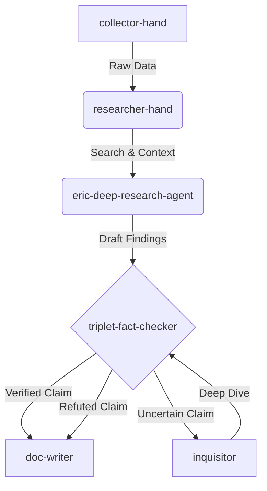
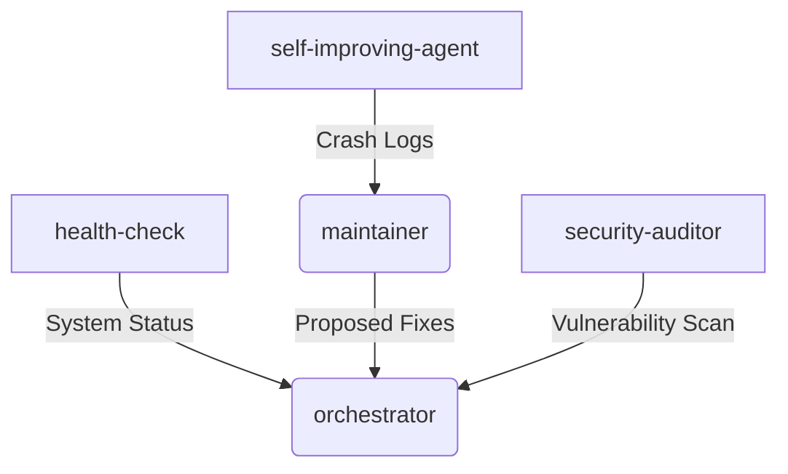

# Agent Knowledge Graph & Ontology
# Medialny Dezolator Project

This document uses the `ontology` skill to map the agents, tools, and dependencies within the system.

## Core Workflows

### Disinformation Research & Fact-Checking

### Proactive Operations & Monitoring

## Agent Roles & Skills
- **collector-hand**: Ingests raw data from APIs/feeds.
- **researcher-hand**: General OSINT research and context gathering.
- **eric-deep-research-agent**: Advanced multi-step internet research.
- **triplet-fact-checker**: Structural verification of claims (Subject-Predicate-Object).
- **security-auditor**: Scans logic and infrastructure for vulnerabilities using `security-checklist`.
- **injection-shield**: Intercepts adversarial inputs in the data pipeline.
- **orchestrator**: Main dispatcher and command-center liaison.
- **archivist**: Long-term storage and logging of immutable reports.
- **doc-writer**: Formats standardized markdown reports.
