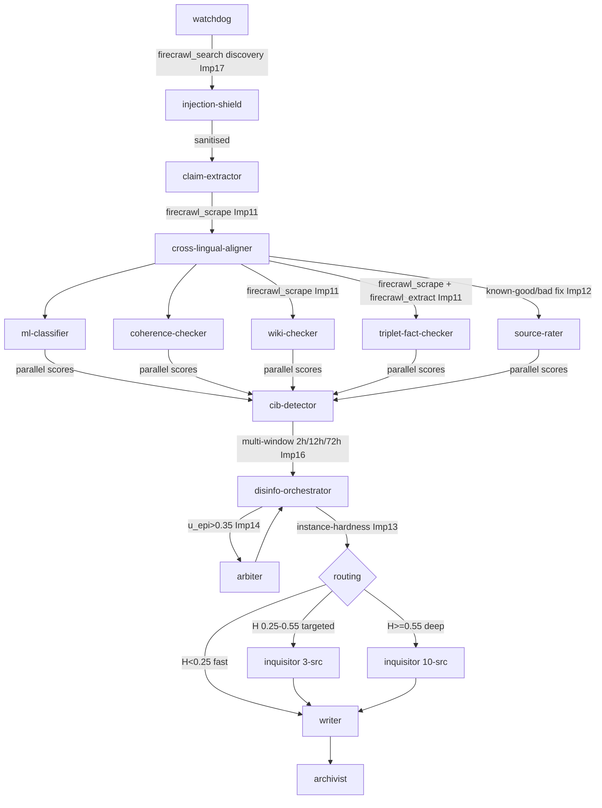
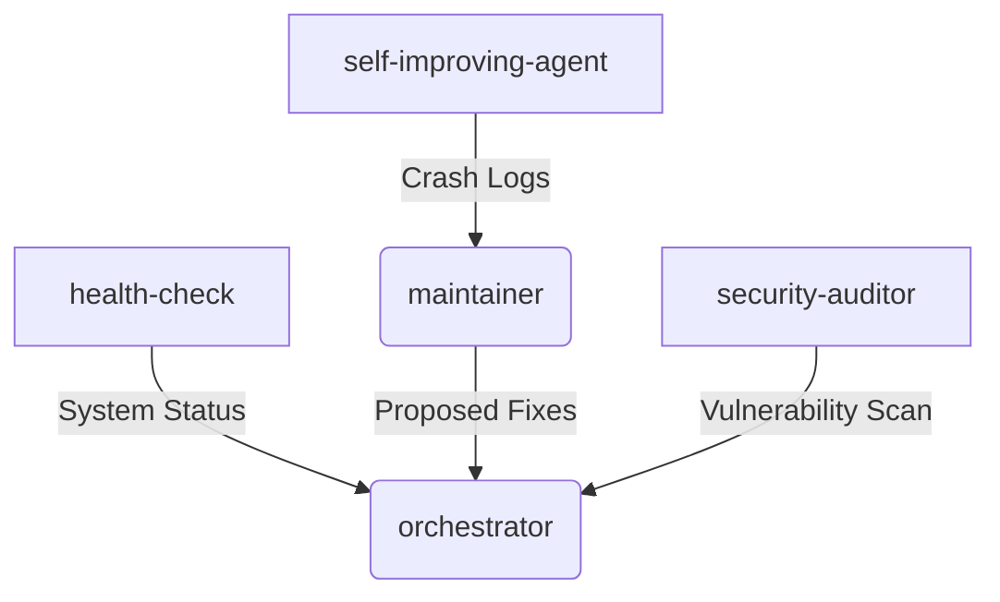

# Agent Knowledge Graph & Ontology
# Medialny Dezolator Project — v3.0.0

This document maps the agents, tools, and dependencies within the system.

## Core Disinformation Detection Pipeline (v3.0.0)

### Primary DAG

### Proactive Operations & Monitoring

## Wave 3 Improvements Summary (2026-06-21)

| # | Agent(s) | Improvement | Source |
|---|---------|-------------|--------|
| 11 | claim-extractor, triplet-fact-checker, wiki-checker | Firecrawl web backend | github.com/firecrawl/firecrawl |
| 12 | source-rater | **Critical bug fix** — known-good/bad lists corrected | Internal audit |
| 13 | disinfo-orchestrator | Instance-hardness dynamic routing | FFarhangian/FakeNewsDetection_DRES |
| 14 | disinfo-orchestrator + arbiter | Adversarial mini-debate | hanshenmesen/Debate-to-Detect (ACL 2024) |
| 15 | disinfo-orchestrator | F2-score optimised weights | futa.edu.ng ensemble research 2025 |
| 16 | cib-detector | Multi-window CIB (2h/12h/72h) | Internal gap analysis |
| 17 | watchdog | Firecrawl search discovery layer | github.com/firecrawl/firecrawl |
| 18 | wiki-checker | Weight comment fix (0.25→0.22) | Internal consistency |

## Agent Roles & Skills

- **watchdog**: Ingests RSS/webhooks, triages, uses `firecrawl_search` for cross-domain spread detection.
- **injection-shield**: Blocks adversarial inputs before pipeline entry.
- **claim-extractor**: NER-based claim extraction with `firecrawl_scrape` for JS-heavy Slovak news portals.
- **cross-lingual-aligner**: SK/CZ/DE/EN query variants; Wikidata Q-ID resolution.
- **ml-classifier**: TF-IDF/LR simulation; top_signals feed adversarial debate Affirmative case.
- **coherence-checker**: LLM coherence/logic/fallacy detection (64% standalone, 0.16 weight).
- **wiki-checker**: Wikipedia/Wikidata NER verification with `firecrawl_scrape` (0.22 weight).
- **triplet-fact-checker**: S-P-O web verification with `firecrawl_scrape` + `firecrawl_extract`.
- **source-rater**: Credibility scoring with corrected known-good/bad lists (0.12 weight).
- **cib-detector**: Multi-window (2h/12h/72h) coordinated inauthentic behaviour analysis.
- **disinfo-orchestrator**: 5-agent ensemble with Bayesian+F2 weights, instance-hardness routing, mini-debate.
- **arbiter**: Judge in adversarial mini-debate; Bayesian consensus in workflow pipeline.
- **writer**: HITL-gated report generation (3-tier confidence system).
- **inquisitor**: Deep adversarial fact-check (3-source targeted or 10-source deep per hardness routing).
- **narrative-tracker**: Campaign detection and CIB scoring.
- **investigator**: Full actor/network investigation for high-CIB claims.
- **archivist**: Immutable logging of verdicts and debunks.
- **impact-comms**: Bilingual (SK+EN) debunk generation.
- **security-auditor**: Infrastructure and logic vulnerability scanning.

## Ensemble Weight Summary (v3.0.0)

| Agent | Default Weight | Error Rate | F2 Weight (after 20 disinfo verdicts) |
|-------|---------------|------------|---------------------------------------|
| ml-classifier | 0.26 | e ≈ 0.18 | Computed from FNR |
| triplet-fact-checker | 0.24 | e ≈ 0.12 | Computed from FNR |
| wiki-checker | 0.22 | e ≈ 0.22 | Computed from FNR |
| coherence-checker | 0.16 | e ≈ 0.36 | Computed from FNR |
| source-rater | 0.12 | new signal | Computed from FNR |

## Environment Variables Required

| Variable | Purpose |
|----------|---------|
| `OPENROUTER_API_KEY` | Primary model provider |
| `NVIDIA_API_KEY` | Default model |
| `DASHSCOPE_API_KEY` | Qwen/fast models |
| `FREELLMPOOL_API_KEY` | Fallback model pool |
| `BRAVE_API_KEY` | Primary web search |
| `TAVILY_API_KEY` | Search fallback |
| `FIRECRAWL_API_KEY` | **Wave 3** web fetch/extract/search (optional, falls back gracefully) |
