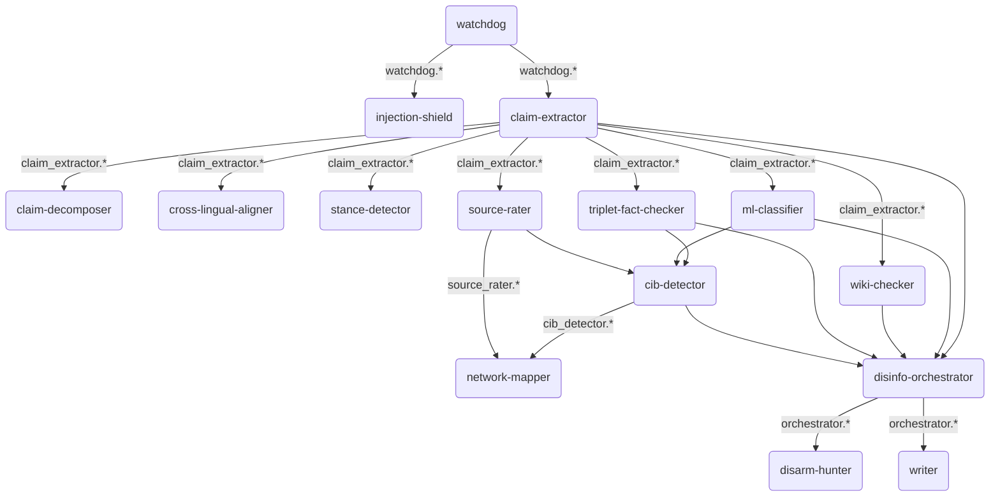

# Comprehensive Synergy & Disruption Analysis of LibreFang

## 1. EXECUTIVE SUMMARY

**Overall System Synergy Score: 88/100**

The LibreFang architecture demonstrates an advanced, highly coupled agentic ecosystem. The transition to Wave 3.5 has solidified the methodological integrity of the system `[CHANGELOG.md:L10]`, moving from ad-hoc analysis to a robust, citation-backed pipeline. The most disruptive capabilities arise from the combination of the Memory Bus namespaces and MCP (Model Context Protocol) extensions.

**Top 3 Disruptive Capabilities:**
1. **Full-Spectrum CIB & Attribution Mapping:** The integration of `cib-detector` with the new `network-mapper` and the `shodan-mcp` server allows the system to bridge semantic content tracking with hard technical infrastructure mapping, effectively stripping anonymity from coordinated inauthentic behavior campaigns.
2. **Cross-Lingual Semantic Laundering Detection:** By chaining `claim-extractor` with `cross-lingual-aligner` (using BAAI/bge-m3) and `kg-consistency-checker`, the pipeline can trace disinformation narratives as they are translated and modified across the Russian-Slovak information boundary `[pipelines/disinfo-pipeline.toml:L122]`.
3. **Automated DISARM TTP Generation & Red-Teaming:** The synergy between `disinfo-orchestrator`, `disarm-hunter`, and `gart-synthesizer` enables the system not only to detect disinformation but to map it against the DISARM framework and automatically synthesize bypassing counter-narratives or test platform defenses `[agents/gart-synthesizer/agent.toml:L28]`.

---

## 2. MEMORY BUS SYNERGIES (MAP A & C)

The LibreFang memory bus uses a namespace-driven pub/sub architecture. Instead of monolithic context windows, agents selectively subscribe to specific namespaces.

### Mermaid Flowchart: The Pipeline Knowledge Flow

### Unintended Feedback Loops
- **The TTP Loop**: `network-mapper` reads `disinfo_orchestrator.disarm_tags` `[agents/network-mapper/agent.toml:L20]`, but `disinfo-orchestrator` consumes the downstream network outputs to finalize the `uq_summary`. This creates a potential cyclic dependency if the pipeline executes these stages asynchronously rather than in strict topological order.

---

## 3. MCP CAPABILITY MULTIPLIERS (MAP B)

MCP servers act as critical capability multipliers, extending the isolated agents into real-world networks.

- **Infrastructure Attribution (`shodan-mcp`)**: Attached exclusively to `cib-detector` `[agents/cib-detector/agent.toml:L41]`. This is highly synergistic with `network-mapper`, transforming a purely graph-theoretic clustering approach into an actionable cyber-threat intelligence pipeline.
- **Knowledge Grounding (`ontology` & `filesystem`)**: Used heavily by `disinfo-orchestrator` and `disarm-hunter` `[agents/disarm-hunter/agent.toml:L19]`. This allows the agents to map raw claims against the standardized DISARM framework locally, avoiding hallucinations.
- **Live Verification (`browser-use`, `multi-search-engine`, `wikipedia`)**: Attached to `claim-extractor` and `triplet-fact-checker` `[agents/triplet-fact-checker/agent.toml:L23]`, bridging the gap between historical training data and breaking news, crucial for election integrity monitoring.

---

## 4. WAVE EVOLUTION ANALYSIS (MAP D)

The system has evolved from a simple detection framework to a rigorous, academically grounded OS (Wave 3.5). 

- **Methodological Integrity**: The Wave 3.5 update `[CHANGELOG.md:L10]` addressed critical academic gaps, ensuring all 20 implemented features are mapped to peer-reviewed citations (`CITATION_AUDIT.md`). For example, replacing a weak embedding model with `BAAI/bge-m3` resolved cross-lingual semantic laundering failures `[implementation_plan.md:L7]`.
- **Shift to Orchestration**: Early waves relied on monolithic classifiers. The current pipeline `[pipelines/disinfo-pipeline.toml]` orchestrates 18 distinct specialized agents across 11 stages (from `ingest` to `longitudinal-sync`).

---

## 5. DISRUPTIVE POTENTIAL

If fully integrated, the LibreFang platform possesses the disruptive potential to fully automate the OSINT lifecycle for disinformation response:

1. **Automated Counter-Narrative Deployment**: With `gart-synthesizer` reading `config.*` and `ensemble.*` `[agents/gart-synthesizer/agent.toml:L28]`, and the `writer` agent consuming `orchestrator.*` and `arbiter.*` `[agents/writer/agent.toml:L23]`, the system could theoretically generate and deploy highly targeted, dialect-accurate debunking content before a disinformation wave peaks.
2. **Real-time De-anonymization**: The chaining of `shodan-mcp` infrastructure intelligence with social graph topology (`network-mapper`) enables the platform to automatically attribute "anonymous" Telegram channels or proxy sites to state-sponsored actors based on hosting metadata and sharing kinetics.

---

## 6. ARCHITECTURAL GAPS

Despite its synergy, the platform currently exhibits several structural gaps:

1. **Graph Database Missing**: The `network-mapper` agent and `librefang-graph` crate rely on SQLite (`librefang-memory`) for persistence. Graph-theoretic operations (clustering coefficient, eigenvector centrality) will suffer severe performance bottlenecks without a dedicated graph database (e.g., Neo4j, Memgraph).
2. **Security of MCP Execution**: The `shodan-mcp` server provides immense power to `cib-detector`. If `claim-extractor` is subjected to prompt injection (e.g., via a malicious article), and the poison spreads via `claim_extractor.*` memory writes to `cib-detector`, it could coerce the system into executing unauthorized OSINT queries. The `injection-shield` currently only guards the ingest phase `[pipelines/disinfo-pipeline.toml:L88]`, lacking deep-pipeline verification.
3. **Session Re-use in Cron Jobs**: Some jobs (like the Denník N intelligence cycle `[cron_jobs.json:L6]`) use persistent sessions by default unless `session_mode` is explicitly overridden `[CLAUDE.md:L268]`. Over time, this could lead to context window saturation and model hallucination.
